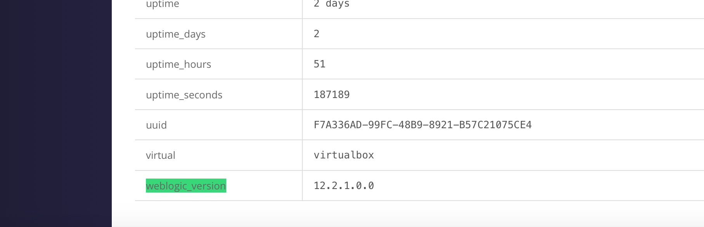

# Custom Facts
[Facter](https://docs.puppet.com/facter/latest/) is an open-source tool for inspecting your system and is an integral part of Puppet.  Facter gives users the ability to gather inventory information on a hundred or so different items on nodes connected to Puppet.

Once Puppet *knows about* a particular fact, it will appear in the console on a node's inventory tab and can also be used as a variable in your Puppet Code to allow conditional logic.

Out-of-the-box, this is already quite useful but one thing you can also do with Facter is to create your own facts about things your interested in such as databases, in-house applications and information required for auditing.

In this post, we'll have a look at how to do this for something I'm interested in:  The version of WebLogic I'm running

## How do facts work?
Facts are just key/value pairs where the `key` is the `name` of the fact and the value is the value of the fact.  Eg:
```
osfamily => RedHat
```

The value is obtained by running Ruby scripts on the agent node.  Since we can use Ruby to run other scripts that might already exist, this means we can capture the output of any command or script we need and then have it sent to the master the next time Puppet runs.

## Creating a custom fact

### Module
Custom facts are always delivered inside modules, so the first thing to do is to create a module (geoffwilliams is my [Puppet Forge](https://forge.puppet.com/) username):
```shell
puppet module generate geoffwilliams-weblogic_version
```

### Fact skeleton
Custom facts need to be created in the `lib/facter` directory inside the module in order for Puppet to process them, so lets create this directory:

```shell
cd weblogic_version/
lib/facter -p
```

Once the directory is created, we can start writing the ruby code for the fact.  By convention, the filename should be the name of the fact being created and then a `.rb` file extension, in this case we could creat the file `lib/facter/weblogic_version.rb`.

Lets add the following content to see if we can get a *Hello, World!* message printed:
```ruby
Facter.add(:weblogic_version) do
  setcode do
    "Hello, World!"
  end
end
```

### Testing the fact
We can test our custom fact by setting the `FACTERLIB` variable to point to the location of the new fact we're working on and then specifying the name of the fact we want to lookup:

```shell
FACTERLIB=/vagrant/weblogic_version/lib/facter/ facter  weblogic_version
```

This is a quick and easy way to test new facts without having to publish them to a master and run Puppet.  The path `/vagrant/weblogic_version` should be changed to the full path to module your working on.

Running the above command gives me the message
```
Hello, World!
```

### Doing something more useful
Printing a message is all well and good but we were supposed to be looking up the WebLogic version so we still have a little more work to do.  With our skeleton created, all we have to do is figure out what command we need to run to extract the version number from WebLogic and then we can plug it into the custom fact.

Since I've never used WebLogic before, I had quick search on google and found [the answer](http://onlineappsdba.com/index.php/2011/04/28/how-to-find-oracle-weblogic-server-version/).  Using the information on the page, I was able to come up with an [awk](https://en.wikipedia.org/wiki/AWK) command to grab the version number out of the file:

```shell
awk 'BEGIN { FS = "=" } /WebLogic Server/ { gsub(/[">]/, "", $4) ; print $4 } ' ./Oracle/Middleware/Oracle_Home/inventory/registry.xml
```

All I needed to do now was to plug this into the skeleton:
```ruby
Facter.add(:weblogic_version) do
  setcode do
    Facter::Core::Execution.exec('awk \'BEGIN { FS = "=" } /WebLogic Server/ { gsub(/[">]/, "", $4) ; print $4 } \' /home/app/Oracle/Middleware/Oracle_Home/inventory/registry.xml')
  end
end
```

Here you can see that the `Facter::Core::Execution.exec` method has been used to capture the output of the shell command.  I've also changed the input filename to be the full path the file I need to read.

Since this whole fact is written in Ruby, I could also have used Ruby's native file and string support to parse the file.  This is left as an exercise for the reader since most people who deal with Puppet aren't programmers.

Testing the fact one more time gives the correct result - cool!
```shell
FACTERLIB=/vagrant/weblogic_version/lib/facter/ facter  weblogic_version
12.2.1.0.0
```

### Almost finished...
As it stands, we can now capture the weblogic version, but what if WebLogic isn't installed (yet)?

Lets try our `awk` command again pointing it at a non-existant xml file:
```shell
awk 'BEGIN { FS = "=" } /WebLogic Server/ { gsub(/[">]/, "", $4) ; print $4 } ' ./Oracle/Middleware/Oracle_Home/inventory/registry.xml_NOTHERE
awk: cmd. line:1: fatal: cannot open file `./Oracle/Middleware/Oracle_Home/inventory/registry.xmlx' for reading (No such file or directory)
```

Uh-oh - we get an error.  Since the command we're running is a small BASH script, the easiest way to work around this is to use BASH's built-in error handling to print out a message telling the user that WebLogic isn't installed, while directing the any errors from `awk` to `/dev/null`.  Our command now looks like this:
```shell
awk 'BEGIN { FS = "=" } /WebLogic Server/ { gsub(/[">]/, "", $4) ; print $4 } ' ./Oracle/Middleware/Oracle_Home/inventory/registry.xml_NOTHERE 2>/dev/null || echo "not installed"
```

Adding this command back into our ruby code gives us:
```ruby
Facter.add(:weblogic_version) do
  setcode do
    Facter::Core::Execution.exec('awk \'BEGIN { FS = "=" } /WebLogic Server/ { gsub(/[">]/, "", $4) ; print $4 } \' /home/app/Oracle/Middleware/Oracle_Home/inventory/registry.xml 2>/dev/null || echo "not installed"')
  end
end
```

Re-testing the fact shows it still works:
```shell
FACTERLIB=/vagrant/weblogic_version/lib/facter/ facter  weblogic_version
12.2.1.0.0
```

### Publishing to the Puppet Forge
With the module all tested (and documented), its ready to go on the Puppet Forge.  To build the module, just run the command:

```shell
puppet module build
```
I can then upload the module to my Puppet Forge account to make it available to the world:
https://forge.puppet.com/geoffwilliams/weblogic_version/readme

#### GitHub
Of course, I also made the module source code available on GitHub over at https://github.com/GeoffWilliams/puppet-weblogic_version so that others can contribute to and improve the code if they find it useful.

### Deploying the module
The easiest way to deploy the module is to run the `puppet module install` command that the Puppet Forge shows on the page above:

````shell
puppet module install geoffwilliams-weblogic_version
```

**Note:**  If your using R10K or Code Manager, you will need to add the module to your [Puppetfile](https://github.com/puppetlabs/r10k/blob/master/doc/puppetfile.mkd) and redploy your control repository.

After the puppet agent has run once on a node after deploying the module to the master, you should be able to see the fact in the console by looking on the inventory tab for the node your interested in:



### What else can I do with this fact?
As well as being used for pure reporting, you can write Puppet Code that directly uses the new fact.  In our case, the new fact will be exposed in the `$weblogic_version` variable.

We can also use [MCollective](https://docs.puppet.com/mcollective/) to perform live [inventory reports](https://docs.puppet.com/mcollective/reference/ui/nodereports.html).  These can be used to generate CSV reports of things like software versions across your entire infrastructure so can be really useful if there are audit requirements you need to adhere to.
