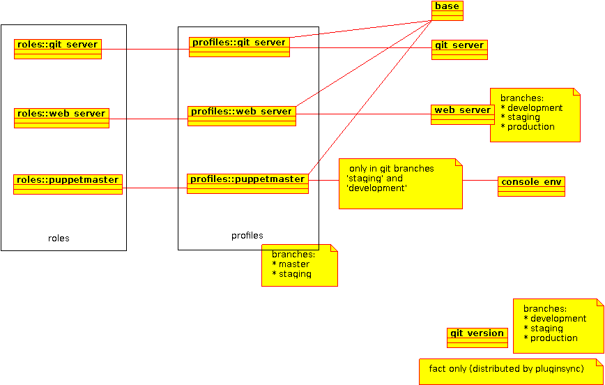

# Integrating R10K, environments and hiera-eyaml
Larger organisations will benefit from the use of environments in puppet but these have been tricky to setup and maintain in the past. This article will show you how you can quickly get up and running with all of the above from a cold start with a fresh Puppet Enterprise installation. Because there are quite a few steps involved as well as background knowledge, the main tasks have been broken out into smaller articles.
Lab setup

A lab of CentOS VMs is used to demonstrate the concepts in this article. In addition to a puppetmaster server, there is also a private git server and a separate client system that will be used to host a web and database server.

All VMs are provisioned as Centos 6.5 32bit, installed with Puppet Enterprise and have their certificates signed as a starting point. Since R10K relies on a git server, I used puppet to setup the Atlassian Stash git server to store all of the puppet code developed for this research.
Integration Guide

The articles below give some background information on R10K and then go on to show how each component can be integrated into the puppet master:
1. [WTF is R10K](wtf_is_r10k)
2. [Installing R10K](installing_r10k_in_puppet_enterprise)
3. [Environments in depth](environments_in_depth)
4. [R10K and hiera-eyaml](r10k_hiera_eyaml)

# A real-world scenario
Now that all of the above components are integrated and working, lets try and use them in a real-world scenario:

* Setup the Atlassian Stash git server
* Three R10K environments – development, staging and production
* different version of forge modules installed per-environment:

| Module 	          | development |	staging |	production |
| ----------------- | ----------- | ------- | ---------- |
| puppetlabs/stdlib |	4.2.2 	    | 4.1.0 	| default    |
| puppetlabs/concat |	1.1.0 	    | 1.1.0 	| default    |
| puppetlabs/apache |	default 	  | default | default    |
| puppetlabs/mysql 	| default 	  | default |	default    |
* module to create a fact with the current version of git installed (with development, staging and production versions of the module available)
* module to install Apache and MySQL with 5x databases and 5x websites (with development, staging and production versions of the module available)
* Roles and Profiles must be used
* The Profiles must use Hiera and Automatic Data Binding should be disabled (via Puppet) hiera-eyaml data for each environment

## Atlassian Stash
Unfortunately Stash requires an updated Git package vs the one supplied with Centos. There is a later version available in the rpmforge-extras yum repository but installing it with puppet is not simple as its necessary to override packages in the base operating system.

I was able to get this working by using exec like this:

```
 exec { "install-git":
   unless  => "/bin/rpm -q git",
   command => "/usr/bin/yum -y --noplugins --enablerepo=rpmforge-extras install git",
   require => Class["yum"],
 }
```
I bounced this approach off some colleagues and one of them said it made his skin crawl. Unfortunately there doesn't seem to be a simple way to do this “properly”. The other suggested approaches were:
1. Deliver the RPM file using puppet
This is a good approach for simple packages but git unfortunately has a ton of dependencies so this isn't practical
2. Self-host an RPM repository
Probably a good idea anyway for users with a large amount of systems to maintain since this reduces internet traffic, speeds up software installation and reduces load on distribution repository servers. I'm not doing this at the moment as its too much work
3. Repackage git to be a single RPM and deliver it with puppet
This is the worst alternative solution because it requires:
* Setting up a box with all the required build tools
* In-depth knowledge of RPM to build the packages
* Diligently following commits on the upstream git sourcecode to follow important bug and security fixes
* Lots of repetitive manual labour at each stage (...unless someone writes a script to automate it)

Noting this, I continued with my ugly and 'wrong' exec based approach and soon after I was able to login to stash using an evaluation licence.

## Environments and modules
The techniques in the the environments in depth article are used to create the three required environments by creating a different git branch for each required environment.

Each environment has a different `PuppetFile` specifying module version according to the requirements above. Due to stdlib 4.1.0 not being certified to run with the version of Puppet Enterprise I'm using- 3.4.3 (Puppet Enterprise 3.2.1) it was necessary to load this module directly from GitHub to get it to install as the module tool will refuse to install it from the forge.

Each module is exists in its own git repository or the puppet forge and they are assembled together by the R10K tool when it is executed. Since no environment called 'master' is supposed to exist, I deleted the master branch from the git repository and this ensured the environment did not exist on the puppet master.

# Modules
## Roles and profiles
I used the roles and profiles pattern to simplify node classification and map the modules and hiera data I want to use in each profile. The diagram below outlines how this was implemented on the lab system.



## git version

A git_version module was created to deliver a custom fact in the file /lib/facter/git_version.rb. As there is a requirement for three branches for this module, I made the fact slightly different in each branch and then mapped each branch in git to the corresponding environment, simulating the evolution of a module undergoing development.

Each version delivers a slightly different version of the git_version fact. Using the following script, I was able to cycle through what the fact does in each environment
```bash
# cat testfacts.sh
#!/bin/bash
for E in development staging production; do
   echo $E
   puppet agent --environment $E -t > /dev/null
   facter -p git_version
done
# ./testfacts.sh
development
1.7.12.4
staging
git version 1.7.12.4
production
git-1.7.12.4-1.el6.rfx.i686
```

## Websites and databases
A module called web_server was created to deliver the databases and websites to the user, as well as creating some /etc/hosts entries to allow testing. After running puppet, I had 5x databases and 5x virtual hosts as required. Since I was also required to supply 3 different versions of the module, I used this to highlight ongoing development of the module by way of improvements to the index.html file for each virtual host. This is only done as an illustration – no one is suggesting you use puppet to replace your CMS!
```
# cat test_host.sh
#!/bin/bash
for E in development staging production; do
   echo $E
   puppet agent --environment $E -t > /dev/null
   cat /var/www/vhosts/site3.puppetlabs.vm/index.html
   echo
done
# ./test_host.sh
development
<html>
 <head>
   <title>site3.puppetlabs.vm</title>
 </head>
 <body>
   <h1>Welcome to site3.puppetlabs.vm</h1>
   <p>
   <marquee>Content coming soon.. :D</marquee>
   </p>
 </body>
</html>

staging
<marquee>site3.puppetlabs.vm</marquee>
production
site3.puppetlabs.vm
```

## Hiera and automatic data binding
All modules I wrote for this article use hiera to obtain the data they need to process their modules. Automatic data binding was disabled by adding the line
```
data_binding_terminus = "none"
```
To the `[main]` section in `puppet.conf`. This prevents hiera data 'magically' appearing in manifests when variable names match which is difficult to trace when there are problems.

##Hiera-eyaml
The last remaining task is to start using the selective encryption capabilities of hiera-eyaml by encrypting the password for the database server on the web server.

The password for MySQL is controlled by the profiles::web_server::root_password key in the hiera/nodes/client.puppetlabs.vm.yaml file within the R10K puppet repository. If we look at the yaml file, we can see the database server is not very secure:
```
profiles::web_server::root_password: "topsecret"
```

Since hiera-eyaml has been sitting in the background the entire time, setting a new encrypted value is easy. I decided to only change the password in the production environment, allowing weak and easy passwords for development and staging.

Lets pick a new 'secure' password and encrypt it
```
# /opt/puppet/bin/eyaml encrypt -s "stilltopsecret"
string: ENC[PKCS7,MIIBeQYJKoZIhvcNAQcDoIIBajCCAWYCAQAxggEhMIIBHQIBADAFMAACAQEwDQYJKoZIhvcNAQEBBQAEggEAvJYtMWghL6+YDvwIfZuYbxyae0T5RK0uzsfaaE5b95984ovtrnitJ3zH8Fd0FwnOUJAdc1nkq/XNC2imkf7Qy78FN1rhCQ5lhkuxJXKWdk/uMVAmC9UnZvz+kpe80krxUsslOe2Jb/WzlYbshMeuBnqePx2A/c39pmQevkVR+94NUmsTvTXOYf2MFc1jknKql+Sp12KZtyOuz/F7sLTfiCuYm5c2HCsoANyFUrDwrJXrPBKR/fFoq5yTInH4wYLABGH7J6hXbL9pugMymi6yJz2gG+9DkB+t0JrvQeVIxWHaSDSzlhhIpblP017W71dreCEz5ff02YsGZyWWNYRK0DA8BgkqhkiG9w0BBwEwHQYJYIZIAWUDBAEqBBACUA0fcmzTX828aLEj1Q8vgBAdowXhVZCWqfo9wgVTPgjW]
```
OR
```
block: >
   ENC[PKCS7,MIIBeQYJKoZIhvcNAQcDoIIBajCCAWYCAQAxggEhMIIBHQIBADAFMAACAQEw
   DQYJKoZIhvcNAQEBBQAEggEAvJYtMWghL6+YDvwIfZuYbxyae0T5RK0uzsfa
   aE5b95984ovtrnitJ3zH8Fd0FwnOUJAdc1nkq/XNC2imkf7Qy78FN1rhCQ5l
   hkuxJXKWdk/uMVAmC9UnZvz+kpe80krxUsslOe2Jb/WzlYbshMeuBnqePx2A
   /c39pmQevkVR+94NUmsTvTXOYf2MFc1jknKql+Sp12KZtyOuz/F7sLTfiCuY
   m5c2HCsoANyFUrDwrJXrPBKR/fFoq5yTInH4wYLABGH7J6hXbL9pugMymi6y
   Jz2gG+9DkB+t0JrvQeVIxWHaSDSzlhhIpblP017W71dreCEz5ff02YsGZyWW
   NYRK0DA8BgkqhkiG9w0BBwEwHQYJYIZIAWUDBAEqBBACUA0fcmzTX828aLEj
   1Q8vgBAdowXhVZCWqfo9wgVTPgjW]
```
Getting this into hiera is a simple cut and paste job. The previous line in the yaml file now looks like this:
```
profiles::web_server::root_password: >
 ENC[PKCS7,MIIBeQYJKoZIhvcNAQcDoIIBajCCAWYCAQAxggEhMIIBHQIBADAFMAACAQEw
 DQYJKoZIhvcNAQEBBQAEggEAvJYtMWghL6+YDvwIfZuYbxyae0T5RK0uzsfa
 aE5b95984ovtrnitJ3zH8Fd0FwnOUJAdc1nkq/XNC2imkf7Qy78FN1rhCQ5l
 hkuxJXKWdk/uMVAmC9UnZvz+kpe80krxUsslOe2Jb/WzlYbshMeuBnqePx2A
 /c39pmQevkVR+94NUmsTvTXOYf2MFc1jknKql+Sp12KZtyOuz/F7sLTfiCuY
 m5c2HCsoANyFUrDwrJXrPBKR/fFoq5yTInH4wYLABGH7J6hXbL9pugMymi6y
 Jz2gG+9DkB+t0JrvQeVIxWHaSDSzlhhIpblP017W71dreCEz5ff02YsGZyWW
 NYRK0DA8BgkqhkiG9w0BBwEwHQYJYIZIAWUDBAEqBBACUA0fcmzTX828aLEj
 1Q8vgBAdowXhVZCWqfo9wgVTPgjW]
```

After pushing these changes to the production git branch and running the R10K tool I could see the password change take effect on the web server the next time I ran puppet and I was then able to login with the new password.

```bash
# puppet agent -t > /dev/null
# mysql --host localhost --user root -p
Enter password:
stilltopsecret
Welcome to the MySQL monitor.  Commands end with ; or \g.
Your MySQL connection id is 1873
Server version: 5.1.73 Source distribution

Copyright (c) 2000, 2013, Oracle and/or its affiliates. All rights reserved.

Oracle is a registered trademark of Oracle Corporation and/or its
affiliates. Other names may be trademarks of their respective
owners.

Type 'help;' or '\h' for help. Type '\c' to clear the current input statement.

mysql>
```

One important caveat of this method is that when puppet was run with the `--test argument`, the encrypted password was visible in the debug output, so bear this in mind and see also the newsgroup link in the R10K and heira-eyaml article.

## Puppet Code
The puppet configuration files and modules that were developed for this article are available as file downloads from this page if you want to take a closer look. The git control files are still present for each included module but the server for 'origin' will of-course be unreachable as it was one of the VMs in the lab.

### Files
* [hiera.yaml](hiera.yaml.txt)
* [puppet.conf](puppet.conf.txt)
* [r10k.yaml](r10k.yaml.txt)
* [r10k_lab.tar.gz](r10k_lab.tar.gz)
