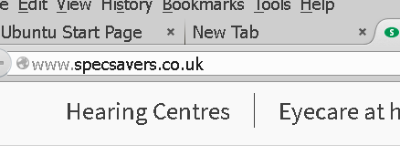

# How to fix ugly blurred fonts on Xubuntu 14.04 and Firefox

It's taken me the best part of a day to figure out how to get fonts on Xubuntu and Firefox to not trick me into thinking I need glasses. Here's how you can fix your fonts if your not a fan of really blurry anti-aliasing.

```bash
# windows true-type fonts
sudo apt-get install ttf-mscorefonts-installer
# helvetica
sudo apt-get install texlive-fonts-recommended
# Tahoma
wget http://download.microsoft.com/download/ie6sp1/finrel/6_sp1/W98NT42KMeXP/EN-US/IELPKTH.CAB
cabextrsact -F 'tahoma*ttf' IELPKTH.CAB
mkdir -p /usr/share/fonts/truetype/msttcorefonts/
mv -f tahoma*ttf /usr/share/fonts/truetype/msttcorefonts/
chmod 644 /usr/share/fonts/truetype/msttcorefonts/tahoma*
fc-cache -v
rm -f IELPKTH.CAB

# kill the blur
sudo rm /etc/fonts/conf.d/10-antialias.conf
# fix hinting
sudo rm /etc/fonts/conf.d/10-hinting-slight.conf
sudo rm /etc/fonts/conf.d/10-hinting-full.conf
sudo ln -s /etc/fonts/conf.avail/10-hinting-full.conf /etc/fonts/conf.d/10-hinting-full.conf
```

# Activate changes
```bash
sudo dpkg-reconfigure fontconfig

Now you can enjoy read without needing to visit the optician ;-) - See screenshot:


