# IBus setup on Kubuntu
There's quite a few steps to follow if you want to setup Kubuntu to work with different input methods such as Korean (Hangul).  These are the steps I had to do on Kubuntu 16.04 to get it working.  Hopefully this is useful to anyone else who was stuck with this :)


# 1. Install packages
IBus seems to be the way to go if you want to type on a non-english keyboard.  First you need to install an appropriate engine.  To see what's available:
```shell
$ apt-cache search ibus |grep engine
ibus-anthy - anthy engine for IBus
ibus-anthy-dev - anthy engine for IBus, development files
ibus-chewing - Chewing engine for IBus
ibus-hangul - Hangul engine for IBus
ibus-m17n - m17n engine for IBus
ibus-sunpinyin - sunpinyin engine for ibus
ibus-table - table engine for IBus
ibus-table-extraphrase - Extra phrase for table engine of ibus
ibus-array - Array 30 input engine for iBus
ibus-kkc - Japanese Kana Kanji input engine for IBus
ibus-kkc-dbg - Japanese Kana Kanji input engine for IBus - debugging symbols
ibus-libthai - Thai input method engine for IBus based on LibThai
ibus-mozc - Mozc engine for IBus - Client of the Mozc input method
ibus-skk - SKK engine for IBus
ibus-table-array30 - Array30 input method based on table engine of ibus
ibus-tegaki - tegaki engine for IBus
ibus-braille - Braille input engine for IBus
ibus-libpinyin - Intelligent Pinyin engine based on libpinyin for IBus
ibus-libzhuyin - New Zhuyin engine based on libzhuyin for IBus
ibus-pinyin - Pinyin engine for IBus
```

To try out Korean support, we want the `ibus-hangul` method:
```
$ sudo apt-get install -y ibus-hangul
```

# 2. Configure KDE to start ibus-daemon
We need to tell KDE to start the ibus-daemon on login
## 2.1 Load KDE settings
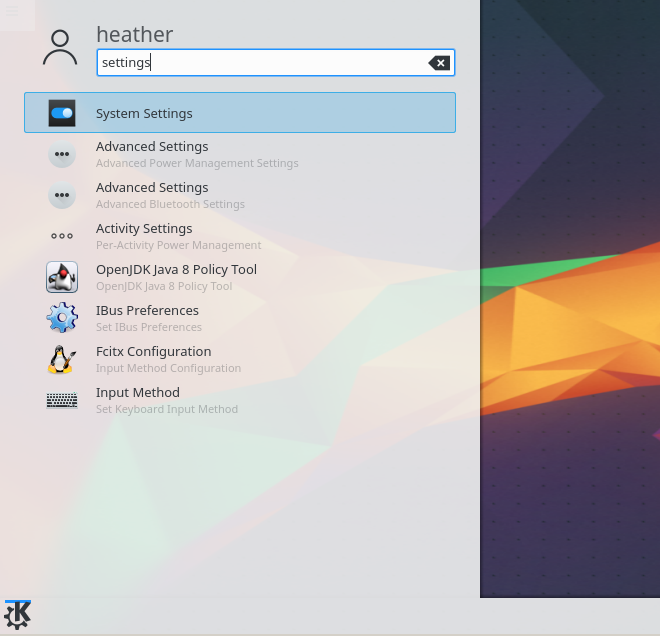

## 2.2 Startup and shutdown
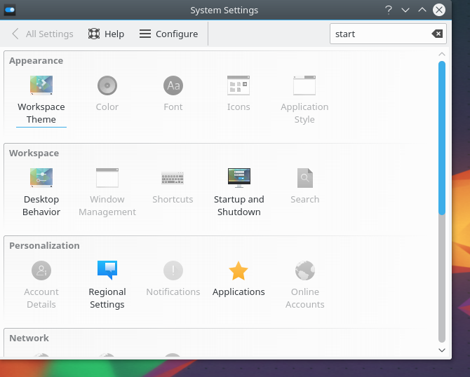

## 2.3 Add ibus-daemon
Click `Add Program...`, then type `ibus-daemon` and click `OK` until the system accepts the change.

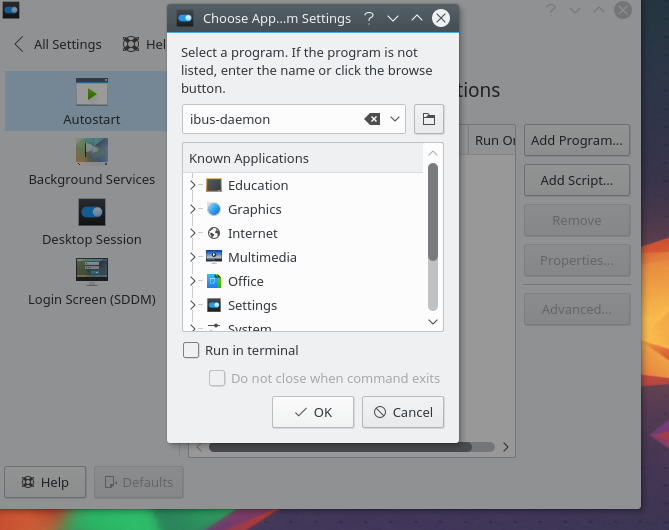

When you've finished, the screen should look like this:

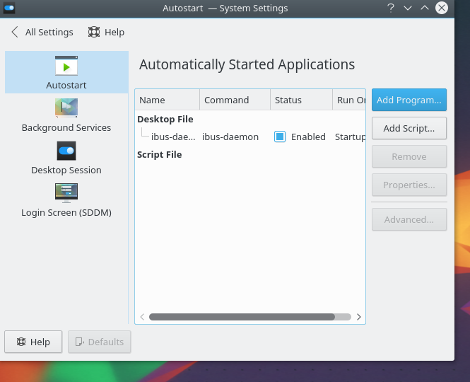

# 3. Configure input methods
Now we need to tell the system to use `ibus`.  I had a few extra options in my list because I was playing earlier ;-)

## 3.1 Run im-config
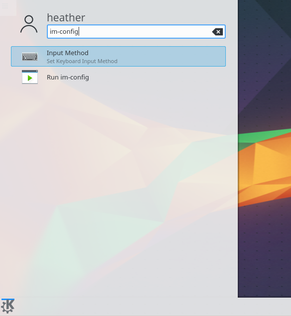

## 3.2 Click OK
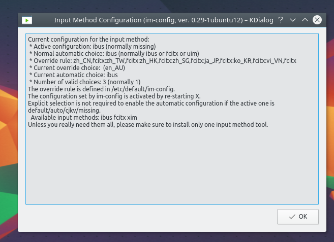

## 3.3 Click Yes
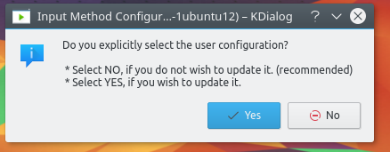

## 3.4 Select ibus
Choose `ibus` from the list and then click `OK`

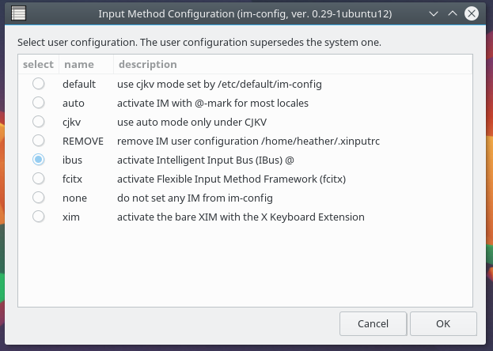

## 3.5 Summary
Check the summary information and click `OK`

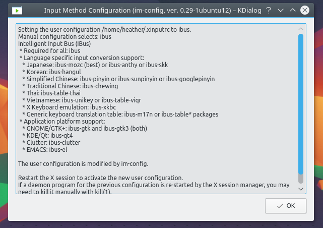

## 3.6 Reboot
Now the important part.  Reboot your computer!

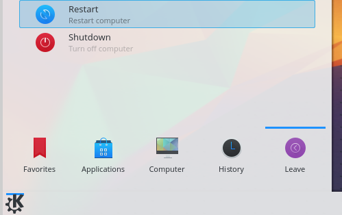

# 4. Using the new input method
## 4.1 Switching input methods
If it all worked, you should now have a new indicator in the panel at the bottom right of the screen.  Here we are still in ENglish mode:


To switch languages, we can click the icon or use `Windows Key` + `Space` at the same time to switch:


The icon will change:


## 4.2 Try out Hangul mode
If we type something now, we can see we are still getting English input, we need to activate Hangul (Korean) mode by pressing `Shift` + `Space` at the same time:

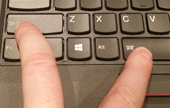

Now we can easily switch between typing in Korean and English.  I used the `kate` editor to practice but you can just try this in firefox and it should work too.  You can also use the icon in the bottom right panel to switch:

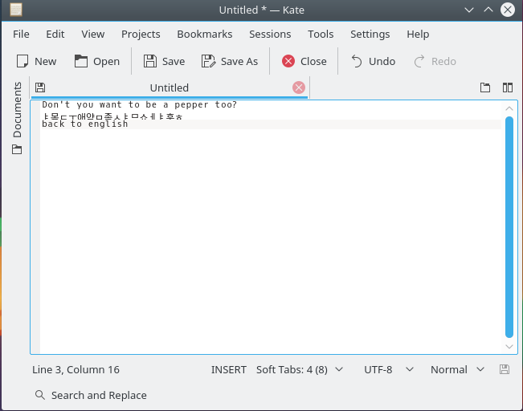

I have no idea what I typed but its working!

# Troubleshooting
If you followed the steps and it didn't work, here are some things to try:
* First of all, make sure you rebooted.  It seems necessary to restart the Xserver for changes to take effect
* Try re-running `im-config` (Step 3) and then reboot - this seemed to fix it for me
* Make sure the `ibus-daemon` process is alive  
