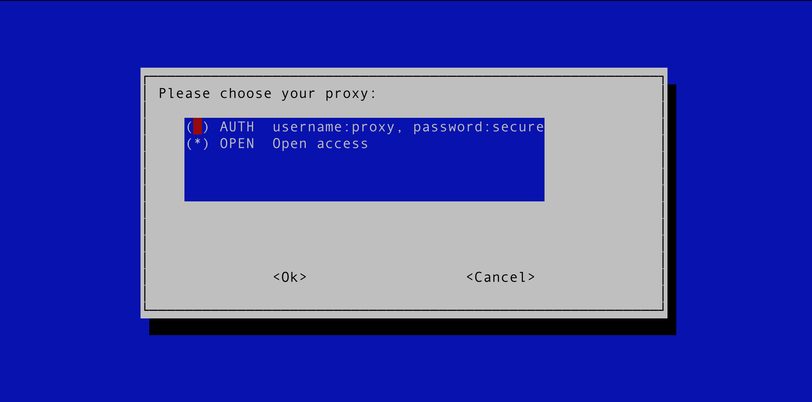

# Test HTTP proxy Vagrant box
Have you ever been tasked with testing a proxy server and realise that you
first need to set one up?

I have... many times... so I've decided to make my life easier and produce a
vagrant box thats setup to supply a working proxy server with easy switching
between authenticated and open access.

To do this I wrote a quick bash [script](https://github.com/GeoffWilliams/stray_puppet_profiles/blob/master/files/proxy) that calls some puppet scripts to switch between
access settings:

# Usage
1.  Have vagrant install the box file (its not been uploaded yet).  
2.  Then create a new VM based on the box
3.  Ensure the VM has the correct networking setup
4.  Boot the VM
5.  Login via ssh, become root and run `proxy`.  This will allow you to pick the proxy settings you want.
