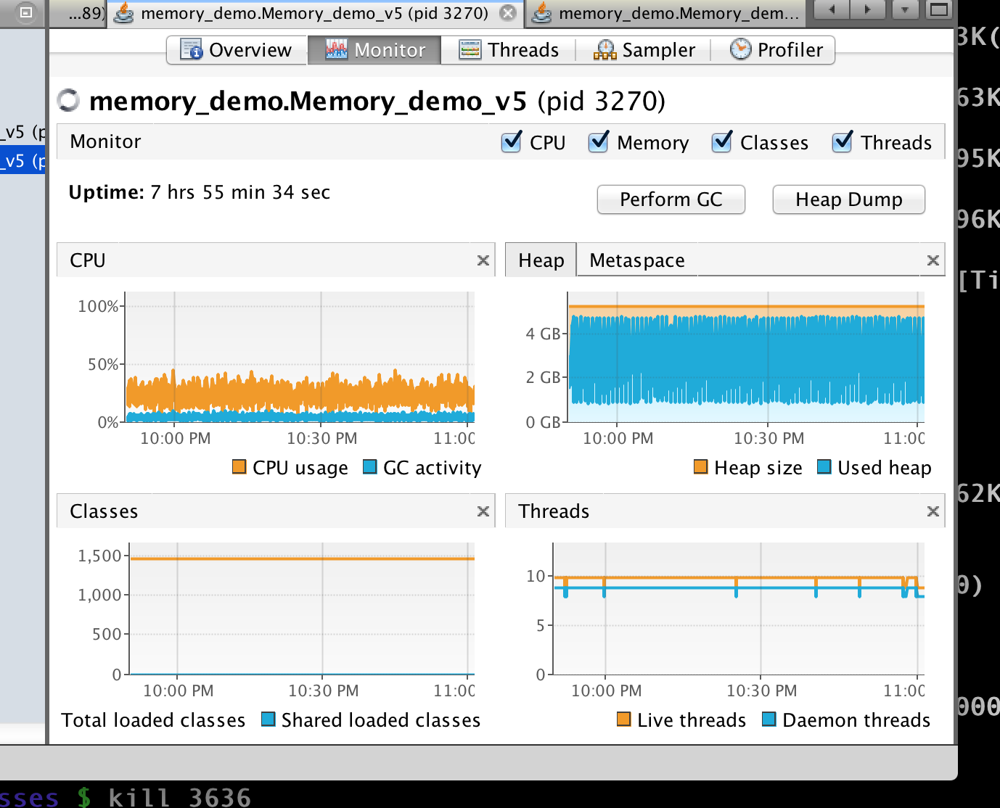
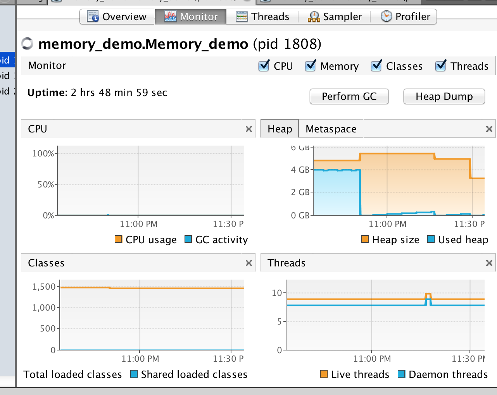

# Garbage collection in Java
Java garbage collection can really be like black magic at times.  Most of the
information out there comes from blog posts (er like this one!) that while
accurate at the time no longer hold true when it comes to a modern JVM
implementation.

With this in mind, and to help a colleague who was curious, I set about doing
some testing of my own by writing code to simulate a badly behaved Java program.

## First steps
I started out with a very simple Java class that allocated 2GB RAM and then
attempted to release it to the OS and was able to capture a few screenshots
from [jvisualvm](https://docs.oracle.com/javase/8/docs/technotes/tools/windows/jvisualvm.html)
which indicate what was going on with the memory while this code was running.

### Concurrent Mark Sweep
The CMS Garbage Collector is one that has a bit of a reputation for allocating
heap and never giving it back.  I set out to prove first-off that this wasn't true
and kind of did so:

This is what happened when I left my program running for a while.  As you can
see, it has eaten all of the memory it was allocated up to `-Xmx`.

Out of frustration, I clicked the `Perform GC` button and saw the used heap
(blue) reduce while the allocated heap (orange) stayed at the same level.  I
went away and did something else for a while and then came back - the memory
usage had now gone up(!).  In theory, there should now only be about 50MB of
data loaded.

Just for fun I clicked the button again and then a few more times in rapid
succession.  This *did* bring down the heap memory allocation, as you can see
from the following screenshot:

Interesting!  At this point (having spent a couple of hours writing code and
watching graphs...) I decided that sitting around taking screen captures and
then trying to remember which one was which was a mugs game so I set out to
automate the testing and graphing procedure.

## Logging and graphing memory usage
I improved the simple [program](https://github.com/GeoffWilliams/memory_demo)
I'd written earlier to simulates a badly behaved program by:
1. Immediately allocating ~2GB RAM to a huge `Map` object
2. Discard the resulting `Map`
3. Create another `Map` object with about 50MB of data
4. Perform random `String` operations on items left in the new and smaller `Map`

Optionally, the user can then choose to perform any of the following additional
actions:
* Perform a single, manual `System.gc()` operation
* Start a thread that periodically runs `System.gc()` until memory usage is
  under control
* Increase the amount of Objects being generated to simulate a higher working
  load

The program includes a background thread that outputs memory usage in CSV
format which I was then able to process with another tool I wrote [csv2svg_graph](https://github.com/GeoffWilliams/csv2svg_graph) to generate some SVG graphs showing memory usage over the course of each experiment.

Finally, I wrote a bash script to run batches of tests for an hour or so.  I
did originally try running everything at once but this resulted in the laptop
grinding to a halt and finally rebooting itself.

## Test environment
* Macbook Pro, Core i7, 16GB RAM, OSX Yosemite 10.10.3, Oracle Java 1.8.0_45-b14
* 7GB heap allocated for each test (`-Xmx7g`)

## Test results
Without further ado, lets run the tests and see what the graphs look like with
Java 8 and each of it's garbage collectors.

### Basic Test
* Some background activity
* Test was run for 3 hours

#### Automatic (JVM decides)

#### Serial

#### Parallel

#### Concurrent Mark Sweep

#### G1

### Object activity
* Simulate heavier load by allocating ~100MB of objects every second
* Test was run for 2 hours

#### Automatic (JVM decides)

#### Serial

#### Parallel

#### Concurrent Mark Sweep

#### G1

## Manually triggered garbage collection
We're always told as Java programmers "never use `System.gc()`"... But what really
happens when we use it?

Calling this method should be the equivalent of pressing the `Perform GC` button
in `jvisualvm` so lets try this out and see if it helps or hinders things.

### Garbage collect once
* Run `System.gc()` *once*, after we've nulled our reference to the large object
* Test was run for 2 hours

#### Automatic (JVM decides)

#### Serial

#### Parallel

#### Concurrent Mark Sweep

#### G1

### GC once followed by object activity
* Same as above but with object activity
* Test was run for 1 hour

#### Automatic (JVM decides)

#### Serial

#### Parallel

#### Concurrent Mark Sweep

#### G1

### Manual Garbage Collection Thread
* Start a thread that runs `System.gc()` once per minute until memory usage is
  brought down
* Test was run for 1 hour

#### Automatic (JVM decides)

#### Serial

#### Parallel

#### Concurrent Mark Sweep

#### G1

### Manual Garbage Collection Thread with object activity
* Same as above but with object activity
* Test was run for 1 hour

#### Automatic (JVM decides)

#### Serial

#### Parallel

#### Concurrent Mark Sweep

#### G1

# Analysis
So what are the take-home messages from all of these graphs?

One of the biggest stand-outs for me was how well Java does at selecting an appropriate garbage collector itself  with regards to memory usage.

Another key point is that running Garbage Collection manually is almost always the wrong solution *unless* your using the Concurrent Mark Sweep garbage collector *and* you need to release a bunch of memory back that would not normally be garbage collected - eg you are running this test program(!).

It important to note _and these graphs to not show this_ that when `System.gc()`/full garbage collection is carried out, the JVM will pause the VM it is running - possibly for a 30 seconds or so.

This can be a deal breaker for web apps or systems that need to be responsive at all times.

In-fact, this is the reason why we had to manually kick the CMS and G1 garbage collectors to get them to reduce the heap size.  As this can only be done when the JVM is paused they will do anything to avoid a full garbage collection which is why you rarely if-ever see these collectors reducing heap in the field - these garbage collectors are dedicated to delivering constant, performance NOT meeting memory usage targets.

# Conclusions
So what is the take-home message from this work:
* The JVM does a great job of selecting the best garbage collector
* If you need to prevent service 'hiccups' due to JVM pauses, CMS or G1 are great choices
* Small changes in the way your program operates can drastically alter the way memory is allocated and released
* JVM parameters can also have a huge effect on CPU/memory usage.
* The JVM *does* release memory to the OS most of the time (but sometimes it needs a kick in the right direction ;-)
* Doing `System.gc()` is normally bad mmmmcay
* If your allocating objects continually and have allocated a large heap, the JVM size will typically not reduce much since its easier to just make a new object in the heap rather then clean up old ones
* Without some level of activity in the JVM, not much activity happens with regards to garbage collection.
* JVMs are selfish!  I never witnessed JVMs sacrificing performance to run garbage collection when overall system memory was low.

# Ok... so what?
Condensing the above:
* In most cases, it makes sense to let the JVM select and tune itself - as it can do a better job then you can...
* ...*unless* you have specific performance requirements - in which case CMS or G1 are good choices
* Your own memory usage and performance will depend on the code that *you* are running!  Simple test cases are the best way of proving a particular behaviour exists
* Garbage collection tuning techniques are all well and good but by far the best way to get better performance and reduced memory usage is to rewrite the bit of code that is sucking up all the memory in the first place!  In the case of the test program I wrote, that would be as simple as commenting the bit of code that allocates 2GB.  Unfortunately, real world problems are not that simple ;-)
