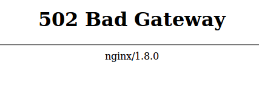
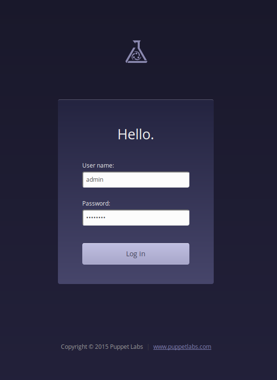

# Puppet under Docker _with R10K_

Ever had the burning desire to run Puppet Enterprise inside a Docker container?  It's possible and I've done it.

## Why?
I didn't feel like managing a fleet of VMs on the cruddy old laptop I'm using as my home network server, I wanted something more light-weight.

At first I used plain Linux-LXC to run a container for Puppet and this worked really well so I forgot about it.

Fast forward a bit and [another project](https://github.com/GeoffWilliams/r10k-control#beaker-tests) gave me a reason to develop a throw-away Puppet Master for doing [Beaker](https://github.com/puppetlabs/beaker/wiki) testing.

A colleague mentioned he'd thought of running Puppet under Docker to manage real machines, so I thought I'd give that a go too.

If nothing else, it should make upgrades fun ;-)

Needless to say this isn't a supported way to run Puppet Enterprise yet!

## Caution
To get this working I'm breaking the rules for both Puppet Enterprise (unsupported platform) and Docker (one process per-container).  If you try this yourself and it breaks you get to keep both pieces.

That said, here's how I did it:

## Setup
The first thing your going to need is a Docker image with Puppet Enterprise installed in it, or rather some way of making one.  

To create these images, I developed a [Ruby script](https://github.com/GeoffWilliams/puppet_docker_images) to do the build since a plain Dockerfile wasn't cutting it for me (things went funny because of systemd).

I've published public Docker images that contain throw-away Puppet Masters on my [Docker Hub](https://hub.docker.com/r/geoffwilliams/) page.  These aren't really useful for anything beyond Beaker testing because they were configured with the hostname `pe-puppet.localdomain`.  Also, all of puppets internal passwords have been published so this probably isn't the most secure of images to be using if you want to do more then simple acceptance testing ;-).

To prepare your system to build the image, checkout the above git repository somewhere on your workstation and install all the rubygems listed in the `Gemfile`.  [Bundler](http://bundler.io/) is about the only sane way of doing this.

## Git setup
To get R10K playing nicely with puppet without broadcasting your secret passwords to the world, its best to have your own git server up and running.  If you already have one, great, use it!  If not, [gitblit](../docker_gitblit) might be a good choice.

Once you've setup a git repository in your server, download and upload yourself a copy of my [r10k-control](https://github.com/GeoffWilliams/r10k-control) repository.

The following terminal capture shows this being done after creating a new repository in the gitblit web interface.  In this case, I've added a git remote called `upstream` pointing to the public GitHub project so that I can receive changes easily in the future:
```shell
$ git clone https://github.com/GeoffWilliams/r10k-control
Cloning into 'r10k-control'...
cd remote: Counting objects: 1144, done.
remote: Compressing objects: 100% (115/115), done.
remote: Total 1144 (delta 62), reused 0 (delta 0), pack-reused 1019
Receiving objects: 100% (1144/1144), 125.13 KiB | 127.00 KiB/s, done.
Resolving deltas: 100% (562/562), done.
Checking connectivity... done.
$ cd r10k-control/
$ git remote add upstream https://github.com/GeoffWilliams/r10k-control
$ git remote remove origin
$ git remote add origin  ssh://admin@git.lan:29418/r10k-control.git
$ git push origin production
The authenticity of host '[git.lan]:29418 ([192.168.1.219]:29418)' can't be established.
RSA key fingerprint is d8:a6:a5:cc:fd:d4:32:e2:61:94:c2:18:c0:71:6c:a2.
Are you sure you want to continue connecting (yes/no)? yes
Warning: Permanently added '[git.lan]:29418,[192.168.1.219]:29418' (RSA) to the list of known hosts.
Password authentication
Password:
Counting objects: 1144, done.
Delta compression using up to 8 threads.
Compressing objects: 100% (491/491), done.
Writing objects: 100% (1144/1144), 125.13 KiB | 0 bytes/s, done.
Total 1144 (delta 562), reused 1144 (delta 562)
remote: Resolving deltas: 100% (562/562)
remote: Updating references: 100% (1/1)
To ssh://admin@git.lan.asio:29418/r10k-control.git
 * [new branch]      production -> production
```
*Important*:  After uploading, you will probably have to change the default branch to be `production` in your git server's web interface.

## Changing the git checkout URI
Once the code is in git, I need to modify my hiera data to point to the new git repository.  The default value is to checkout the public copy.

In my checked-out copy of the repository, I change the value of the `profiles::puppet::r10k::remote` key to match the read-only checkout URL for the local repository.  The file to edit is `/hieradata/common.yaml`.  After editing, it looked like this on my system:

```yaml
profiles::puppet::r10k::remote: "git://git.lan/r10k-control.git"
```

Once this critical detail has been updated, this needs to be committed and pushed to the git server.

## Building the image
With our own customised R10K control repository now available, we can build a new Puppet Enterprise server using the Docker image build script and bake a reference to our local git repository into it:
```shell
./build_image.rb --pe-version 2015.2.1 --tag-version 5 --hostname puppet.lan --r10k-control git://git.lan/r10k-control.git
```

This command will perform a fresh puppet installation configured for the above hostname.  After installing, it will attempt to bootstrap r10k using the r10k control repository's `bootstrap.sh` file.

The last message output by the script indicates the ID of the generated image.

## Making the image available
Once the image is built, it needs to be stored securely.  The ideal way to do this is to use a [private Docker registry](https://docs.docker.com/registry/deploying/).

Once a private registry is available it can be used by tagging the image with the repository URL and then pushing it, e.g:

```shell
docker tag 70fb9b8ea2d65b74c10312dbd88dde372e53f382e9039d77810010e8c8d9cee7 docker.lan:5000/pe2015-2-1_centos-7_aio-master_private:v5
docker push docker.lan:5000/pe2015-2-1_centos-7_aio-master_private:v5
```

## Preparing host data volumes
For everyday data, the easiest way to copy data out of a Docker image is to start a container, copy out the data and then delete the container.  Puppet Enterprise runs PostgreSQL though, so we need to stop this service before copying the data to protect against copying a crashed database.

The directories we need to store on the host as volumes are:
* `/etc/puppetlabs`
* `/var/log`
* `/opt/puppetlabs/server/data`

I decided to store these directories under `/srv/docker/puppet.lan` so that I could find the data easily if required.

On the host, I made a directory structure to hold these volumes:
```shell
mkdir -p /srv/docker/puppet.lan/{etc_puppetlabs,log,server_data}
```
_the required subdirectories will be created by the `docker cp` command_

I then started a throw-away container:
```shell
docker run -d  --privileged --volume /sys/fs/cgroup:/sys/fs/cgroup --hostname puppet.lan docker.lan:5000/pe2015-2-1_centos-7_aio-master_private:v5
```
_NOTE:_  hostname must match what you installed puppet with.

...And used shell access to shutdown the `pe-postgresql` service and verify it was stopped:
```shell
root@docker:/home/geoff# docker shell 4aacc6d3c55941968eac5c88e7059b2dafdbb75b2ac9ad54376276c6a2b6326d
[root@puppet /]# systemctl stop pe-postgresql
[root@puppet /]# ps -eaf|grep post
root      1761  1445  0 17:02 ?        00:00:00 grep --color=auto post
```

Success!  Now all I have to do is copy out the data and destroy this temporary container.  I need to use the tar method of copying data to ensure that the correct file ownership is maintained.

```shell
docker cp 4aacc6d3c55941968eac5c88e7059b2dafdbb75b2ac9ad54376276c6a2b6326d:/etc/puppetlabs -| ( cd /srv/docker/puppet.lan/etc_puppetlabs/ && tar --strip-components 1 -xf - )
docker cp 4aacc6d3c55941968eac5c88e7059b2dafdbb75b2ac9ad54376276c6a2b6326d:/var/log -| ( cd /srv/docker/puppet.lan/log/ && tar --strip-components 1 -xf - )
docker cp 4aacc6d3c55941968eac5c88e7059b2dafdbb75b2ac9ad54376276c6a2b6326d:/opt/puppetlabs/server/data -| ( cd /srv/docker/puppet.lan/server_data/ && tar --strip-components 1 -xf - )
```

## Starting the real Puppet container
With the data extracted safely to volumes, its time to start the _real_ Puppet Enterprise container and add the flags [bridge it to the LAN](../docker_networking)  In my case, the command looks like this:
```shell
docker run -d --privileged \
  --name puppet.lan \
  --volume /sys/fs/cgroup:/sys/fs/cgroup \
  --volume /srv/docker/puppet.lan/etc_puppetlabs:/etc/puppetlabs \
  --volume /srv/docker/puppet.lan/log:/var/log \
  --volume /srv/docker/puppet.lan/server_data:/opt/puppetlabs/server/data \
  --hostname puppet.lan \
  --restart always \
  --net=none \
  -e 'pipework_cmd=br0 -i eth0 @CONTAINER_NAME@ udhcpc ' \
  docker.lan:5000/pe2015-2-1_centos-7_aio-master_private:v5
```

After running this command, we now have a Docker managed Puppet Enterprise 2015.2.1 server that is attached to our network as if it were a regular VM.

If we head to the https://puppet.lan, we now see...



Thankfully, all we need to do to fix this is wait a few moments and then refresh the page



The console works and we can login as `admin`.  The password is `aaaaaaaa` and should be changed via the GUI immediately after logging in.

## Testing
As a quick test, I tried out a few key puppet operations:
* Logging in to the console
* Requesting and signing certificates
* Running the puppet agent on a new node and the puppet master
* MCollective (via `mco ping`)
...Staggeringly, it all seems to work!

## Next steps
* Figure out how to do upgrades between PE versions
* Make arrangements for backups (perhaps an extra volume and a periodic dump from the container)
* ...Peer review ;-)
