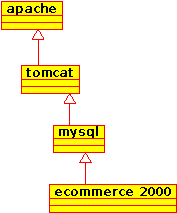
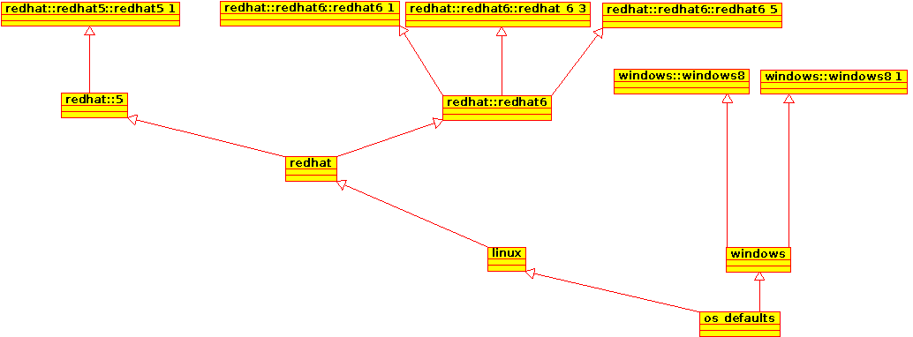

# Inheritance – not just to be avoided in puppet

The general consensus around inheritance in puppet is to only use it when you need to inherit defaults from `params.pp` files. Due to a quirk of the language parser inheritance is the only way to get these variables into scope when setting default parameters when writing a parameterized class.

The rest of time, people writing puppet code are encouraged to simply include classes rather then extend them to make it clear which code is being used at any given time.

## The argument for inheritance
When this point of view is put to a crowd of puppet users, there is normally some understandable objection – often from those who have done Object-Oriented programming in the past. This is because its tempting to create complicated class hierarchy to mirror the structure of your organisation and environment.

These are admirable intentions but can result in a maintenance nightmare as the inheritance structure gets more and more complex. A simple custom e-commerce deployment could end up with a structure looking something like this:

At first glance this looks logical but note that the MySQL module is now inheriting defaults and resources from the tomcat class. Not only does this make NO sense as these services are unrelated, it also offers an opportunity for mistakes to end up in your puppet manifests. A much better approach is to simply perform an include on each class you wish to use as this eliminates all scope problems of this nature.

The real fun starts when these inheritance hierarchies get complicated. Consider the following structure used to setup puppet for different operating systems:

At first glance this too looks logical, even sensible. However it becomes increasingly difficult for anyone maintaining this code to see where values are being sourced from as the hierarchy grows.

Although puppet shares terminology with Object-Oriented programming, the execution of these concepts is often completely different. In the above scenario, you have very limited means to diagnose any problems – typically you would have to add a bunch of notify to each of the classes so that you can follow how puppet has built the dependency graph.

## Favour composition over inheritance
The take-home message from using inheritance with puppet is that it should be avoided in most circumstances. This is a little annoying until you realise that its a good idea to limit your use of inheritance in fully OO programming languages for much the same reasons.

The phrase that's often used to describe this is “Favour composition over inheritance” and if you do a Google search on this you will find a ton of links describing why in great detail.

In a nutshell though, the main advantage of composition over inheritance is that you gain much more flexibility in how to assemble your classes.
Multiple Inheritance

Languages such as Java (and Puppet!) only allow you to inherit from a single superclass which really limits the flexibility you have a programmer if you want to inherit features from more then one class. By using composition by way of interfaces or injected class instances (Java) or by simply using the include keyword (Puppet) You gain the effective ability to inherit from as many classes as you need to without building complex inheritance hierarchies as a workaround.

## Dependency injection
If your using something like Java, you have access to third party libraries such as the excellent Spring Framework which can perform “Dependency Injection” AKA “inversion of control” for you.

The diagram below illustrates this concept in action.

Here, we can see the class `MyClass` contains an instance of an object implementing the `MyService` interface. In this case, there are two implementations of `MyService`. One for regular use (MyServiceImpl) and another for use during testing (MyServiceMock).

The IoC container manages the full life-cycle of all classes in the diagram and is responsible for instantiating and injecting the correct implementation of `MyService` into `MyClass` at runtime. This is typically controlled by either an XML configuration file or in-line annotations in the Java code.

This style of programming lends itself to well to testing as the framework can automatically swap in mock implementations at test time.

As a programmer, I've found that using IoC frameworks vs building complex inheritance hierarchies is a liberating experience as there is suddenly a lot less complexity to worry about and a huge amount of flexibility is gained by abandoning a traditional class inheritance chain.

## Summary
Avoiding inheritance *when appropriate* is recommended for both your Puppet AND Java code!
