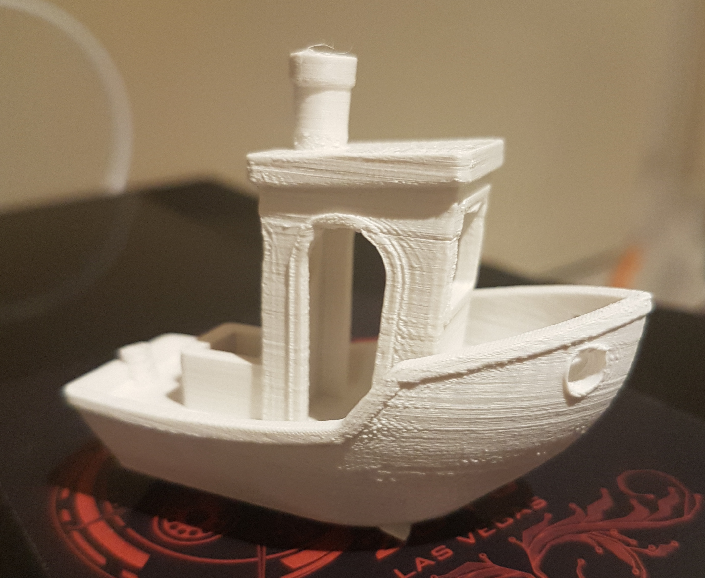

# Up3d MINI GCODE Upgrade

## Why?
The stock UP3D mini firmware is pretty good - UP software gives you a slicer and a GUI all in one program.  There are some restrictions though:
* Have to use windows
* Have to plug the printer into a PC USB socket
* Impossible to turn the support generation off
* Only get a choice of 2 temperatures - PLA or ABS **and** these are the wrong temperatures for most non-UP brand filament

The UP hot-end is better then I ever realised when I bought the printer - it's all-metal and heats up to 300C which is enough to work PETG and most of the exotic filaments that are now available.  Some enterprising folks have got around these restrictions by putting resisters in series with the thermistor or by transcoding GCODE into UP3D code.

This is a lot of hassle and I was in the process of dumping my old UP when I saw a GCODE CPU on ebay for $90 - I bought it and it works great, now I have a fully open source 3d printer I can use with any slicer or filament and which works great with [Octoprint](http://octoprint.org/).

The instructions for setting up this new CPU took me about a day to figure out so hopefully these might be useful to someone.

## Step 1
Buy a [GCODE CPU for Tiertime UP! plus mini cetus 3D printer smoothieware](http://www.ebay.co.uk/itm/222439745965) from tinyfab.xyz on ebay

## Step 2
Open the back of your UP3d, remove the old CPU and insert the replacement.

If you bought an external temperature probe, connect it to the white socket on the underside of the CPU (do before atatching).  The temperature probe bolts on to the back corner of the heater bed through the little hole.  After installing, you'll either have to cut the corner off your perfboard or leave sticking out a bit.  The original heated bed is a bit crap, it only gets up to 39C on my machine (with the heaters on...)– this is important!

### Step 3
Install Octoprint on a spare raspberry pi and connect it to the printer USB, power on the PI and the printer.  Note that with the CPU mod, the power button at the front of the unit is now an emergency stop to kill a print, you don’t use it to turn on the printer.

## Step 4
When booted, the printer will appear as USB mass storage AND a serial device at `/dev/ttyACM0`.

## Step 5
Download firmware+config bundle from tinyfab.xyz(https://drive.google.com/open?id=0BxnykIRpb264MFRhR2YydENKLWM) - updates are published on the tinyfab.xyz facebook page so check there for updates.

## Step 6:
SSH into your raspberry PI, mount the mass storage drive and save the file `mini_v4_config` to the drive as `config.txt`

This file is vital – it sets up how the printer will respond to GCODE commands as well as other things and this is where you will do most of your printer tweaking, NOT in the slicer program like you normally do with the UP3D software.

For a reference guide to all the settings, see:  http://smoothieware.org/configuration-options

The default configuration file has the heated bed disabled, to enable it all you need to do is set `temperature_control.bed.enable` to be `true`, and uncomment the relevant sections for your UP/Cetus.  If you have the external temperature probe, then you need to enable the sensor (thermistor) in the Cetus section but the heater pin in the UP plus/mini section

When your `config.txt` is setup how you want, save, unmount, then power the printer off and on with the switch at the back

## Step 7:
Setup the UP3D in octoprint:
* Device /dev/ttyACM0
* Baud: 250000
* Printbed build volume/size:
  * x: 120
  * y: 120
  * z: 120
* Axes:
  * X - Leave alone
  * Y - Tick invert control
  * Z - Tick invert control, set to 1200
  * Other settings are fine – they will be overriden by GCODE anyway

## Step 8 Click connect to attach to the printer.
Until you command movement, the motors will be powered off and the temperature sensors will read garbage.

Try using the jog arrows to move the printer around, be ready to hit the kill button at the front or power off at the back in case of grinding noises.  You will notice that as soon as you command movement, the fans spin up and the temperature readings become accurate.

## Step 9
Now we need to work out the z height of the printer, just like we do with the UP3D software, but this time we need to type GCODE directly to the printer to work out the numbers we need ;-)  This is all done in octoprint using the control tab to follow the procedure listed at:

[http://smoothieware.org/gamma-max#configuring-z-height](http://smoothieware.org/gamma-max#configuring-z-height)

When you have found the value that will let you just barely glide 2 sheets of paper under the nozzle, you need to save it in the `config.txt` file as `gamma_max`

You can do this by mounting the mass storage on your PI, doing the edit and then umounting.  After changing, power the printer off and then on.

## Step 10
With the printer setup you ready to test it, download and install cura, and also download the [benchy](https://www.thingiverse.com/thing:763622) object from thingiverse.

With cura installed you need to setup the printer:
* Add a new “custom fdm” printer
* Set X, Y, Z to 120mm
* Tick heated bed
* X min 0
* Y min 0
* X max 120
* Y max 120
* Gantry height – leave alone
* In start GCODE, you need to add this line:

  `G92 Z125.5`

  Where `125.5` was the value you saved as `gamma_max` earlier

In the end GCODE section there is some code to unload filament after printing.  If you don’t want this to happen delete it.
In print setup on the main screen, move the switch to `custom` and find the material section.  If you have the original heated bed make sure `build plate temperature` is set to 39C or less – the nozzle only starts heating AFTER the bed is at temperature and since it never goes above 40, you’ll find nothing ever prints with the default settings of 60+C!

## Step 11
Now your ready to print your benchy.  Load it into cura and get it sized however you want.  50% scale is good for a first print.  I found that the default print settings using a brim warped off the print bed immediately but with a raft it worked great.   Save your `.gcode` file to the local computer and then upload it to octoprint by clicking `upload`

## Step 12
Remember how when you clicked the jog button the printer sprang to life and the temperature readings corrected?  This is important!  On my machine, it normally reads a high temperature until it moves – the default GCODE interprets this as the machine being ready to print so helpfully tries to extrude through a cold hot-end :/  To fix this we just need to tell the printer to move before every print job so that the temperatures are accurate.

In octoprint, load settings, GCODE scripts and in the `before print job starts` box type `G28` which tells the printer to center its axes.
With this done your finally ready to print!

## Step 13
Click the print icon on the file you uploaded.  You should see the following things happen:
1. Printer springs to life, fans start turning, temperature FOR PRINT BED is accurate, printer centers axis
2. Print bed slowly heats up towards 39C (if it never reaches this, go lower or get a better heat bed)
3. Once print bed is at temperature (can take a while), hot-end temperature will become accurate and will heat up to whatever you set in cura
4. Once everything is at temperature the model will start to print

A while later you should have a cool benchy!  

## Results
I've been having poor results with this printer for a while now because its been extruding filament far too hot - if I listen carefully it sounds like a bowl of rice crispies as the filament bubbles and burns.  It also STINKS and was giving me really bad headaches!  With the GCODE cpu both of these problems are gone and the benchy looks great!  This definitely gave this printer a new lease of life.  There's still a few imperfections in the benchy which I think are hardware related.  The unit sways a bit because I put it on some felt feet to reduce noise and probably the belts are due for replacement/tightening... its been 4 years though and I've never been happier with the UP MINI - I just wish it had shipped with CPU in the first place

# Troubleshooting
1. make sure nozzle is at correct height
2. make sure you enabled the heated printer bed
3. make sure the print bed perfboard is clean – use alcohol wipes
4. Make sure you use a RAFT not a brim in cura – I found that cura was creating a 1 layer thin base that effectively floated off the build platform towards the center like a sucker and immediately warped to such extent that it snagged the nozzel
5. Watch your first few prints to make sure everything is OK, the power button is now a kill button so hit it to emergency stop any bad prints before they damage your printer
6. If your heatbead can't even warm up to 39C because the its got colder, grab a fan heater and direct it into the chamber at full power ;-)
